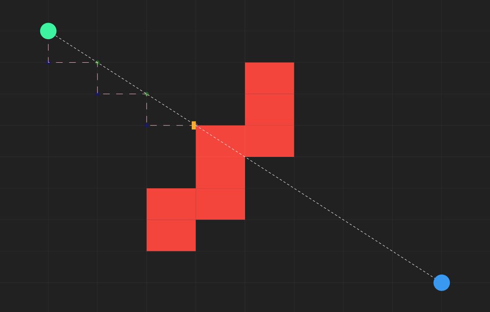

# DDA Algorithm visualizer
A simple program that visualizes the [Digital Differential Analyzer algorithm](https://en.wikipedia.org/wiki/Digital_differential_analyzer_(graphics_algorithm)).

Made for an experiment for the project [JS Raycaster](https://github.com/LeandroSQ/js-raycaster)

	 
	

[Live demo here](https://leandrosq.github.io/dda-algorithm-visualizer/index.html)

## How to use
The screen represents a grid of cells.
Red cells are walls.
Gray cells are empty.
Cyan circle is the starting point.
Turquoise circle is the ending point.

You can click in a cell with the left mouse button to make it a wall. and with the right mouse button to make it empty.

You can drag the starting and ending points with the left mouse button.

## Explanation

The algorithm will automatically show the path between the starting and ending points, and if there is any intersection with a wall.

In summary, the algorithm optimizes [Ray casting](https://en.wikipedia.org/wiki/Ray_casting) for tiled based scenarios.
Instead on hundreds or thousands of iterations for each ray, it can reduce to couple of iterations by jumping to the next cell (Vertically and Horizontally). **In the image above it reduced from 500~ to 6 iterations.**

## Considerations
Big thanks to [Javidx9](https://www.youtube.com/watch?v=NbSee-XM7WA) for the idea and explanation.
